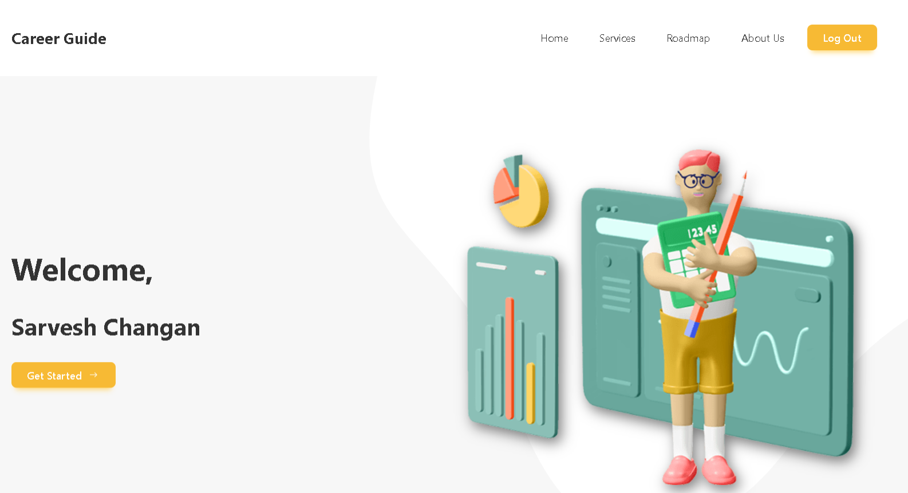

# **Career Guide**

A web application dedicated to empowering aspiring developers with personalized career guidance. The platform offers tailored learning paths, courses, and resources to help users master coding skills and successfully launch their tech careers.

# **Image**

# **View Live Demo**
<a href='https://career-guidance-ten.vercel.app' target='_blank'>View Live</a>

## **Key Features:**

- **Personalized Guidance:** Offers custom learning paths and resources tailored to each user's career goals.
- **Interactive Animations:** Framer Motion enhances user experience with smooth transitions and animations.
- **Secure Authentication:** Auth0 integration for secure and easy user authentication and management.
- **Responsive UI:** Built using React and Tailwind CSS for a seamless user experience across devices.
- **Dynamic Content:** Content is adjusted based on user preferences and progress.

## **Tech Stack:**

- **Frontend:** React, Tailwind CSS, Framer Motion
- **Authentication:** Auth0
- **State Management:** React Hooks & Context API
